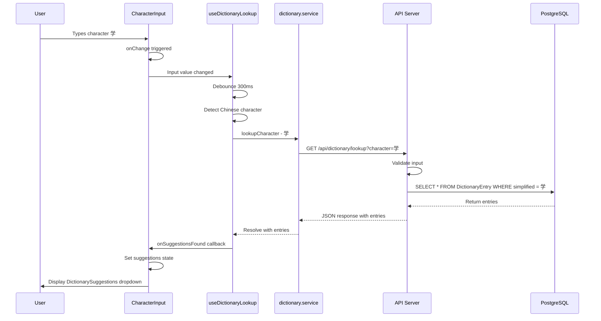
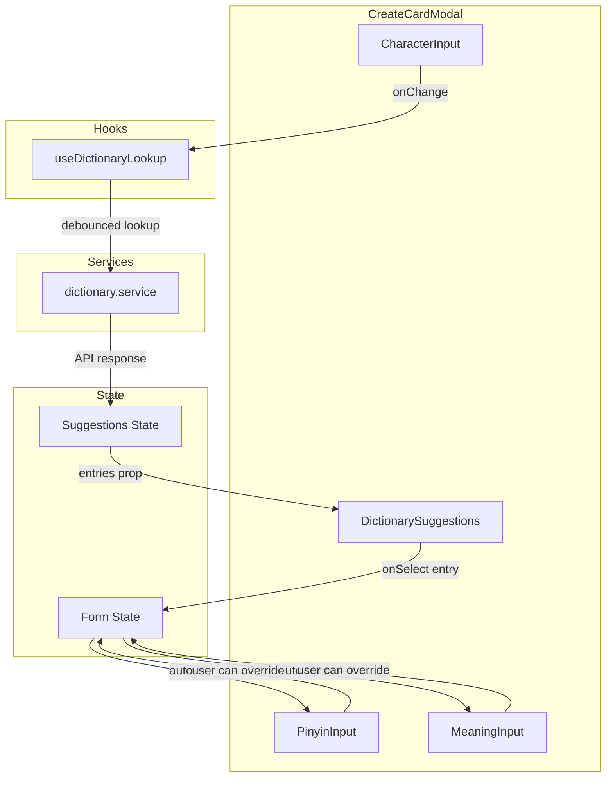
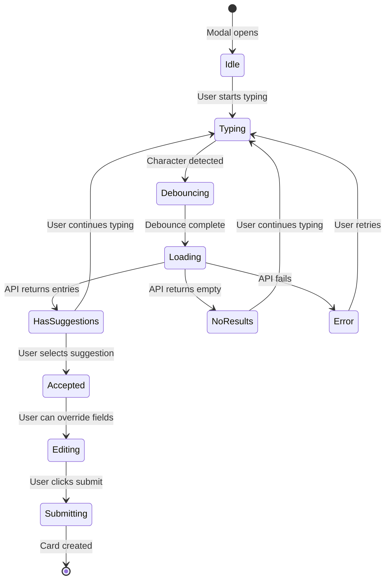

# Architecture Design: User Story 3.1 - Dictionary Auto-Suggest

## Overview

This document describes the architecture for implementing User Story 3.1 from PLAN.md:

> **As a learner**, I want the app to **auto-suggest pinyin, meaning, and HSK level** when I type a character so that I don't have to look things up manually.

### Acceptance Criteria
1. Typing a character triggers CC-CEDICT lookup
2. Suggestions appear below the input field
3. User can accept or override the suggestions

---

## 1. Database Schema Design

### 1.1 New Model: `DictionaryEntry`

Add to [`backend/prisma/schema.prisma`](backend/prisma/schema.prisma):

```prisma
model DictionaryEntry {
  id             String   @id @default(cuid())
  traditional    String   // Traditional Chinese character
  simplified     String   // Simplified Chinese character
  pinyin         String   // Pinyin with tone marks (e.g., "xué")
  pinyinNumeric  String   // Pinyin with tone numbers (e.g., "xue2")
  definitions    String[] // Array of English definitions
  hskLevel       Int?     // HSK level (1-6) if available, null otherwise
  frequencyRank  Int?     // Character frequency rank (optional)
  createdAt      DateTime @default(now())
  updatedAt      DateTime @updatedAt

  // Indexes for fast lookup
  @@index([simplified])
  @@index([traditional])
  @@index([hskLevel])
}
```

### 1.2 Schema Design Rationale

| Field | Purpose |
|-------|---------|
| `traditional` | Some users prefer traditional characters; enables cross-referencing |
| `simplified` | Primary lookup field for mainland Chinese characters |
| `pinyin` | Display-ready pinyin with tone marks |
| `pinyinNumeric` | Alternative format for tone coloring algorithm |
| `definitions` | Array to support multiple meanings per entry |
| `hskLevel` | HSK classification for filtering and organization |
| `frequencyRank` | Optional field for sorting results by common usage |

### 1.3 Migration Strategy

1. Create migration: `npx prisma migrate dev --name add_dictionary_entry`
2. Run data import script (see Section 5)
3. Verify indexes are created and optimized

---

## 2. API Endpoint Specifications

### 2.1 Dictionary Lookup Endpoint

**Endpoint**: `GET /api/dictionary/lookup`

**Description**: Look up dictionary entries by Chinese character

**Authentication**: Optional (public endpoint, but respects auth if provided)

#### Request Parameters

| Parameter | Type | Required | Description |
|-----------|------|----------|-------------|
| `character` | string | Yes | Single Chinese character to look up |
| `variant` | string | No | Either "simplified" or "traditional" (default: "simplified") |

#### Request Example

```http
GET /api/dictionary/lookup?character=学&variant=simplified
```

#### Response Schema

```typescript
interface DictionaryLookupResponse {
  entries: DictionaryEntry[];
  meta: {
    query: string;
    variant: string;
    count: number;
  };
}

interface DictionaryEntry {
  id: string;
  traditional: string;
  simplified: string;
  pinyin: string;
  pinyinNumeric: string;
  definitions: string[];
  hskLevel: number | null;
  frequencyRank: number | null;
}
```

#### Response Example

```json
{
  "entries": [
    {
      "id": "clx123abc",
      "traditional": "學",
      "simplified": "学",
      "pinyin": "xué",
      "pinyinNumeric": "xue2",
      "definitions": [
        "to learn",
        "to study",
        "to imitate"
      ],
      "hskLevel": 1,
      "frequencyRank": 127
    }
  ],
  "meta": {
    "query": "学",
    "variant": "simplified",
    "count": 1
  }
}
```

#### Error Responses

| Status | Description |
|--------|-------------|
| 400 | Missing or invalid `character` parameter |
| 404 | No entries found for the character |
| 500 | Server error |

### 2.2 Backend Implementation Structure

```
backend/src/
├── controllers/
│   └── dictionary.controller.ts    # NEW: Dictionary lookup logic
├── routes/
│   └── dictionary.routes.ts        # NEW: Dictionary API routes
├── validations/
│   └── dictionary.validation.ts    # NEW: Input validation for lookup
└── scripts/
    └── import-cedict.ts            # NEW: CC-CEDICT import script
```

---

## 3. Frontend Component Hierarchy

### 3.1 Component Structure

```
frontend/src/
├── components/
│   ├── card/
│   │   ├── CreateCardModal.tsx     # MODIFIED: Integrate auto-suggest
│   │   └── EditCardModal.tsx       # MODIFIED: Integrate auto-suggest
│   └── dictionary/                 # NEW DIRECTORY
│       ├── CharacterInput.tsx      # NEW: Input with auto-suggest trigger
│       ├── DictionarySuggestions.tsx  # NEW: Suggestions dropdown
│       └── SuggestionItem.tsx      # NEW: Individual suggestion display
├── services/
│   └── dictionary.service.ts       # NEW: Dictionary API client
└── hooks/
    └── useDictionaryLookup.ts      # NEW: Custom hook for debounced lookup
```

### 3.2 Component Descriptions

#### [`CharacterInput.tsx`](frontend/src/components/dictionary/CharacterInput.tsx)

A specialized input component that triggers dictionary lookup on character input.

**Props**:
```typescript
interface CharacterInputProps {
  value: string;
  onChange: (value: string) => void;
  onSuggestionsFound: (entries: DictionaryEntry[]) => void;
  onError?: (error: Error) => void;
  placeholder?: string;
  disabled?: boolean;
  autoFocus?: boolean;
}
```

**Behavior**:
- Debounces input changes (300ms delay)
- Triggers API call when a Chinese character is detected
- Shows loading state during API call
- Handles empty/null results gracefully

#### [`DictionarySuggestions.tsx`](frontend/src/components/dictionary/DictionarySuggestions.tsx)

Dropdown component displaying dictionary suggestions.

**Props**:
```typescript
interface DictionarySuggestionsProps {
  entries: DictionaryEntry[];
  isLoading: boolean;
  onSelect: (entry: DictionaryEntry) => void;
  onClose: () => void;
  visible: boolean;
}
```

**Behavior**:
- Appears below the character input field
- Shows loading skeleton during API call
- Displays pinyin with tone colors
- Shows HSK level badge if available
- Click to accept suggestion
- Click outside or Escape to dismiss

#### [`SuggestionItem.tsx`](frontend/src/components/dictionary/SuggestionItem.tsx)

Individual suggestion item within the dropdown.

**Props**:
```typescript
interface SuggestionItemProps {
  entry: DictionaryEntry;
  onSelect: (entry: DictionaryEntry) => void;
}
```

**Behavior**:
- Displays character (both simplified and traditional if different)
- Shows pinyin with tone coloring
- Lists first 2-3 definitions
- Shows HSK level badge
- Hover state for selection indication

### 3.3 Modified Components

#### [`CreateCardModal.tsx`](frontend/src/components/card/CreateCardModal.tsx) Changes

1. Replace basic `<Input>` for character with `<CharacterInput>`
2. Add `<DictionarySuggestions>` component
3. Add state for suggestions and loading
4. Implement `onAcceptSuggestion` handler to auto-fill pinyin and meaning
5. Allow user to override auto-filled values

#### [`EditCardModal.tsx`](frontend/src/components/card/EditCardModal.tsx) Changes

Same modifications as CreateCardModal, with additional consideration:
- Pre-populate fields with existing card data
- Allow re-triggering lookup if character is changed

---

## 4. Data Flow Diagrams

### 4.1 Sequence Diagram: Character Lookup Flow



### 4.2 Component Data Flow



### 4.3 State Management Flow



---

## 5. CC-CEDICT Data Import

### 5.1 Data Source

- **Source**: [CC-CEDICT](https://www.mdbg.net/chinese/dictionary?page=cc-cedict)
- **Format**: Plain text file with structured entries
- **License**: Creative Commons Attribution-ShareAlike 4.0

### 5.2 CC-CEDICT Entry Format

Each line in CC-CEDICT follows this format:
```
Traditional Simplified [pinyin1] /definition1/definition2/.../
```

Example:
```
學 学 [xue2] /to learn/to study/to imitate/
```

### 5.3 Import Script Design

Create [`backend/src/scripts/import-cedict.ts`](backend/src/scripts/import-cedict.ts):

```typescript
// Pseudocode structure
interface CedictEntry {
  traditional: string;
  simplified: string;
  pinyin: string;        // Convert tone numbers to tone marks
  pinyinNumeric: string; // Keep original format
  definitions: string[];
}

async function importCedict(filePath: string): Promise<void> {
  // 1. Read and parse CC-CEDICT file
  // 2. Skip comment lines (starting with #)
  // 3. Parse each entry using regex
  // 4. Convert tone numbers to tone marks
  // 5. Batch insert into PostgreSQL via Prisma
  // 6. Log progress and statistics
}
```

### 5.4 HSK Level Assignment

HSK levels are not included in CC-CEDICT. Options for adding HSK data:

1. **HSK Word Lists**: Cross-reference with official HSK word lists
2. **External Dataset**: Use HSK data from [hskhsk.com](https://hskhsk.com/) or similar
3. **Manual Curation**: Start without HSK levels, add later

### 5.5 Import Process


---

## 6. Implementation Notes

### 6.1 Pinyin Tone Coloring Algorithm

The frontend should display pinyin with colored tones:

| Tone | Color | Example |
|------|-------|---------|
| 1 (flat) | Red (#EF4444) | mā |
| 2 (rising) | Orange (#F97316) | má |
| 3 (falling-rising) | Green (#22C55E) | mǎ |
| 4 (falling) | Blue (#3B82F6) | mà |
| 5 (neutral) | Gray (#6B7280) | ma |

Implementation approach:
1. Parse `pinyinNumeric` field (e.g., "xue2")
2. Extract tone number from each syllable
3. Apply color styling via CSS classes or inline styles

### 6.2 Debouncing Strategy

Use a 300ms debounce delay to:
- Reduce unnecessary API calls
- Allow user to finish typing multi-character words
- Improve performance and user experience

Implementation: Use `useDeferredValue` or custom `useDebouncedCallback` hook.

### 6.3 Multi-Character Words

CC-CEDICT contains both single characters and multi-character words. For US-3.1:

**Phase 1 (MVP)**: Support single character lookup only
- Detect if input is exactly one Chinese character
- Only trigger lookup for single characters

**Phase 2 (Future)**: Support multi-character word lookup
- Allow lookup of 2+ character words
- Show all matching entries

### 6.4 Error Handling

| Scenario | User Experience |
|----------|-----------------|
| Network error | Show toast notification, allow manual entry |
| No results found | Show "No suggestions found" message, allow manual entry |
| Multiple results | Show all entries, let user choose |
| API rate limited | Graceful degradation, allow manual entry |

### 6.5 Performance Considerations

1. **Database Indexing**: Ensure `simplified` and `traditional` columns are indexed
2. **Connection Pooling**: Use Prisma connection pool for concurrent requests
3. **Caching**: Consider Redis caching for frequently looked-up characters
4. **Pagination**: Not needed for single character lookup (typically 1-5 results)

### 6.6 Accessibility

- Ensure dropdown is keyboard navigable (Arrow keys, Enter, Escape)
- Provide ARIA labels for screen readers
- Maintain focus management when suggestions appear/disappear

---

## 7. File Changes Summary

### 7.1 Backend Files (New)

| File | Purpose |
|------|---------|
| `backend/src/controllers/dictionary.controller.ts` | Dictionary lookup controller |
| `backend/src/routes/dictionary.routes.ts` | Dictionary API routes |
| `backend/src/validations/dictionary.validation.ts` | Input validation schemas |
| `backend/src/scripts/import-cedict.ts` | CC-CEDICT import script |

### 7.2 Backend Files (Modified)

| File | Changes |
|------|---------|
| `backend/prisma/schema.prisma` | Add `DictionaryEntry` model |
| `backend/src/routes/index.ts` | Export dictionary routes |

### 7.3 Frontend Files (New)

| File | Purpose |
|------|---------|
| `frontend/src/components/dictionary/CharacterInput.tsx` | Input with lookup trigger |
| `frontend/src/components/dictionary/DictionarySuggestions.tsx` | Suggestions dropdown |
| `frontend/src/components/dictionary/SuggestionItem.tsx` | Individual suggestion |
| `frontend/src/components/dictionary/index.ts` | Barrel export |
| `frontend/src/services/dictionary.service.ts` | Dictionary API client |
| `frontend/src/hooks/useDictionaryLookup.ts` | Debounced lookup hook |
| `frontend/src/lib/pinyin-tones.ts` | Tone coloring utilities |

### 7.4 Frontend Files (Modified)

| File | Changes |
|------|---------|
| `frontend/src/components/card/CreateCardModal.tsx` | Integrate auto-suggest |
| `frontend/src/components/card/EditCardModal.tsx` | Integrate auto-suggest |

---

## 8. Testing Strategy

### 8.1 Backend Tests

- Unit tests for dictionary controller
- Integration tests for API endpoint
- Validation tests for input parameters
- Import script tests with sample data

### 8.2 Frontend Tests

- Component tests for CharacterInput
- Component tests for DictionarySuggestions
- Integration tests for CreateCardModal with auto-suggest
- E2E tests for full user flow

### 8.3 Test Scenarios

1. Single character lookup returns correct entry
2. Traditional character lookup works
3. No results handling
4. User can override auto-filled values
5. Debouncing prevents excessive API calls
6. Keyboard navigation in suggestions dropdown

---

## 9. Dependencies

### 9.1 New Backend Dependencies

| Package | Purpose |
|---------|---------|
| None | All functionality uses existing Prisma/Express stack |

### 9.2 New Frontend Dependencies

| Package | Purpose |
|---------|---------|
| `@tanstack/react-query` (optional) | Caching and state management for API calls |
| `use-debounce` (optional) | Debouncing utility |

Note: These can be implemented with custom hooks if dependencies should be minimized.

---

## 10. Future Enhancements

The following are out of scope for US-3.1 but noted for future sprints:

1. **Multi-character word lookup** (US-3.1 extension)
2. **Pinyin tone coloring across the app** (US-3.2)
3. **Offline dictionary caching** (Sprint 7 PWA)
4. **Audio pronunciation** (Sprint 3-4)
5. **Example sentences** (US-6.3)
