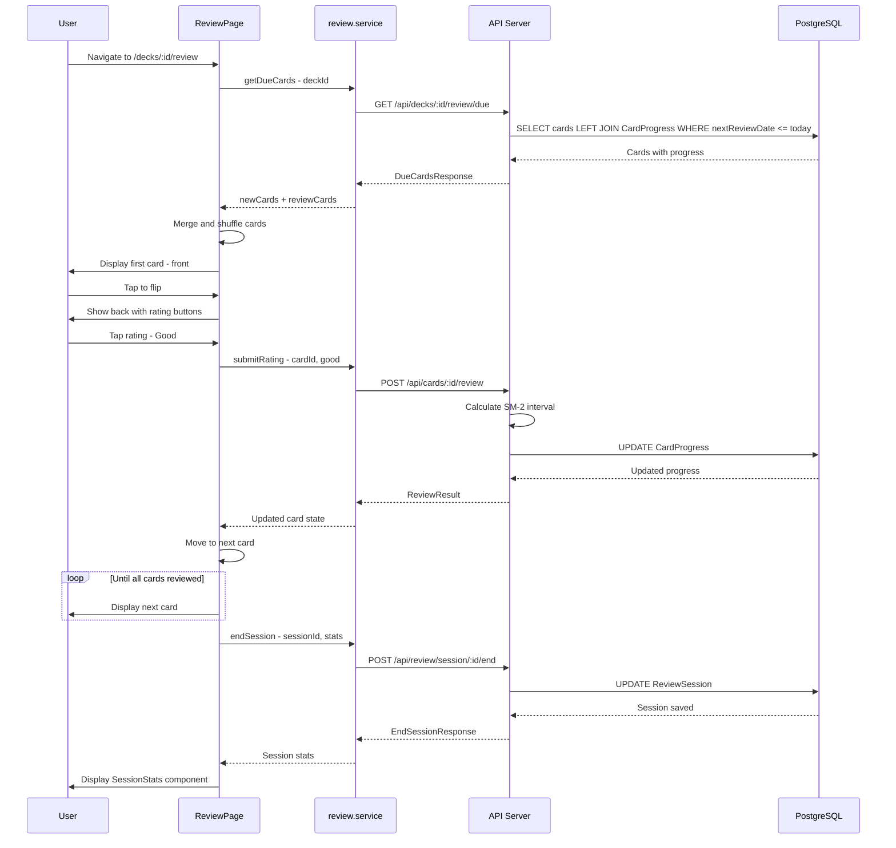
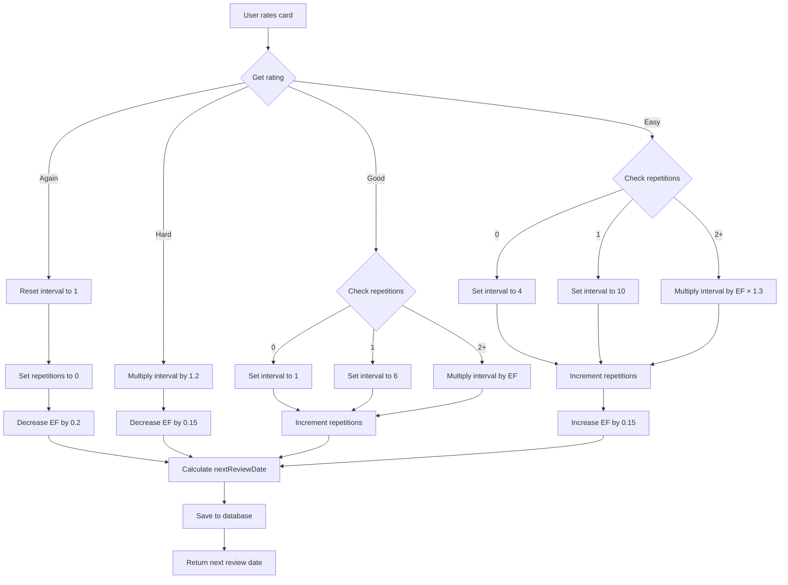
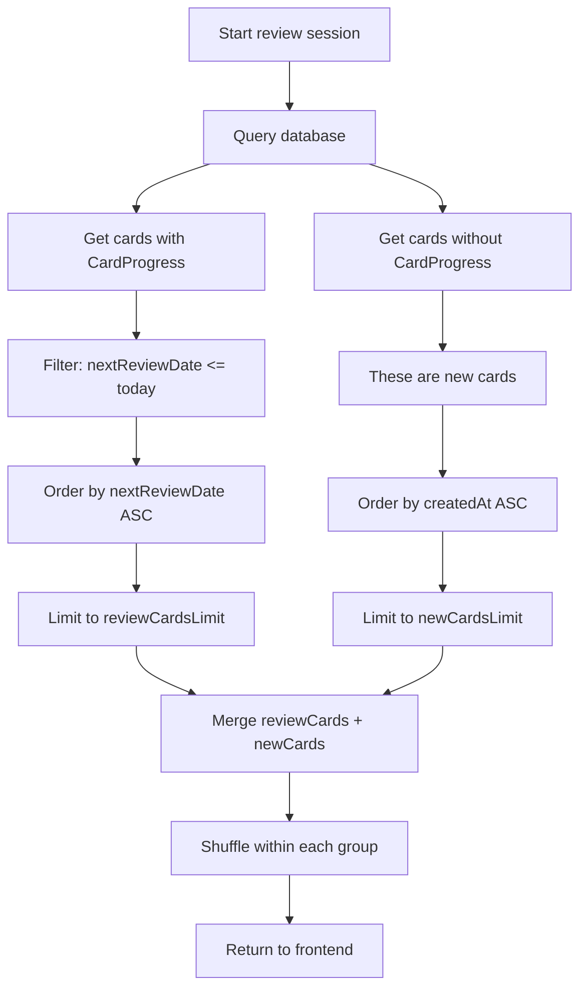
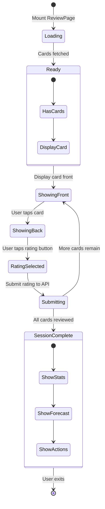

# Architecture Design: User Stories 2.1-2.5 - SM-2 Spaced Repetition System

## Overview

This document describes the architecture for implementing User Stories 2.1 through 2.5 from PLAN.md, focusing on the SuperMemo 2 (SM-2) spaced repetition algorithm integration.

### User Stories Covered

| # | User Story | Description |
|---|------------|-------------|
| US-2.1 | 4-Level Rating System | User can rate recall as Again, Hard, Good, or Easy |
| US-2.2 | SM-2 Algorithm | Implement spaced repetition scheduling |
| US-2.3 | Due Cards Filtering | Show only cards due for review |
| US-2.4 | New Cards Introduction | Configurable new cards per session |
| US-2.5 | Session Analytics | Post-session statistics and progress metrics |

---

## 1. Database Schema Changes

### 1.1 New Model: `CardProgress`

Add to [`backend/prisma/schema.prisma`](backend/prisma/schema.prisma):

```prisma
model CardProgress {
  id             String   @id @default(cuid())
  cardId         String   @unique
  easeFactor     Float    @default(2.5)      // SM-2 ease factor (min: 1.3)
  interval       Int      @default(0)        // Days until next review
  repetitions    Int      @default(0)        // Consecutive successful recalls
  nextReviewDate DateTime @default(now())    // When card is due next
  lastReviewDate DateTime @default(now())    // Last time card was reviewed
  lapses         Int      @default(0)        // Number of times card was forgotten
  createdAt      DateTime @default(now())
  updatedAt      DateTime @updatedAt
  
  card           Card     @relation(fields: [cardId], references: [id], onDelete: Cascade)
  
  @@index([nextReviewDate])
  @@index([cardId])
}
```

### 1.2 Update Existing `Card` Model

Modify the existing `Card` model to include the relation:

```prisma
model Card {
  id        String   @id @default(cuid())
  deckId    String
  character String
  pinyin    String
  meaning   String
  createdAt DateTime @default(now())
  updatedAt DateTime @updatedAt
  deck      Deck     @relation(fields: [deckId], references: [id], onDelete: Cascade)
  progress  CardProgress?  // NEW: One-to-one relation
  
  @@index([deckId])
}
```

### 1.3 New Model: `ReviewSession` (Optional - for analytics)

```prisma
model ReviewSession {
  id          String   @id @default(cuid())
  userId      String
  deckId      String
  startedAt   DateTime @default(now())
  endedAt     DateTime?
  totalCards  Int      @default(0)
  correct     Int      @default(0)      // Good + Easy ratings
  incorrect   Int      @default(0)      // Again + Hard ratings
  duration    Int?                      // Duration in seconds
  createdAt   DateTime @default(now())
  
  user        User     @relation(fields: [userId], references: [id], onDelete: Cascade)
  deck        Deck     @relation(fields: [deckId], references: [id], onDelete: Cascade)
  reviews     ReviewRecord[]
  
  @@index([userId])
  @@index([deckId])
  @@index([startedAt])
}
```

### 1.4 New Model: `ReviewRecord` (Optional - for detailed analytics)

```prisma
model ReviewRecord {
  id           String   @id @default(cuid())
  sessionId    String
  cardId       String
  rating       String                      // 'again', 'hard', 'good', 'easy'
  responseTime Int?                        // Time to answer in milliseconds
  reviewedAt   DateTime @default(now())
  
  session      ReviewSession @relation(fields: [sessionId], references: [id], onDelete: Cascade)
  
  @@index([sessionId])
  @@index([cardId])
}
```

### 1.5 Update `User` Model

Add relation for review sessions:

```prisma
model User {
  id              String   @id @default(cuid())
  email           String   @unique
  passwordHash    String
  charVariant     String   @default("simplified")
  createdAt       DateTime @default(now())
  updatedAt       DateTime @updatedAt
  decks           Deck[]
  reviewSessions  ReviewSession[]  // NEW
}
```

### 1.6 Update `Deck` Model

Add relation for review sessions:

```prisma
model Deck {
  id             String   @id @default(cuid())
  userId         String
  name           String
  createdAt      DateTime @default(now())
  updatedAt      DateTime @updatedAt
  cards          Card[]
  user           User     @relation(fields: [userId], references: [id], onDelete: Cascade)
  reviewSessions ReviewSession[]  // NEW
}
```

### 1.7 Schema Design Rationale

| Table | Purpose |
|-------|---------|
| `CardProgress` | Stores SM-2 algorithm state per card (ease factor, interval, next review date) |
| `ReviewSession` | Tracks each study session for analytics and history |
| `ReviewRecord` | Individual card reviews within a session for detailed analytics |

| Field | Purpose |
|-------|---------|
| `easeFactor` | SM-2 multiplier for interval calculation (default 2.5, min 1.3) |
| `interval` | Days until next review (0 = new card, 1 = learning, n = review) |
| `repetitions` | Consecutive correct recalls (resets to 0 on "Again") |
| `lapses` | Total times card was forgotten (for analytics) |
| `nextReviewDate` | When the card should be shown next |
| `lastReviewDate` | When the card was last reviewed |

---

## 2. API Endpoint Specifications

### 2.1 Get Due Cards for Review

**Endpoint**: `GET /api/decks/:deckId/review/due`

**Description**: Fetch cards that are due for review, including new cards

**Authentication**: Required (JWT)

#### Request Parameters

| Parameter | Type | Required | Description |
|-----------|------|----------|-------------|
| `newCards` | number | No | Maximum new cards to include (default: 20) |
| `reviewCards` | number | No | Maximum due cards to include (default: 100) |

#### Response Schema

```typescript
interface DueCardsResponse {
  newCards: CardWithProgress[];
  reviewCards: CardWithProgress[];
  meta: {
    deckId: string;
    deckName: string;
    totalNewCards: number;      // Total new cards in deck
    totalDueCards: number;      // Total cards due today
    newCardsLimit: number;      // Configured limit
    reviewCardsLimit: number;   // Configured limit
  };
}

interface CardWithProgress {
  id: string;
  deckId: string;
  character: string;
  pinyin: string;
  meaning: string;
  progress: CardProgress | null;  // null for new cards
}

interface CardProgress {
  easeFactor: number;
  interval: number;
  repetitions: number;
  nextReviewDate: string;
  lastReviewDate: string;
  lapsses: number;
}
```

#### Response Example

```json
{
  "newCards": [
    {
      "id": "clx123",
      "deckId": "deck456",
      "character": "学",
      "pinyin": "xué",
      "meaning": "to learn",
      "progress": null
    }
  ],
  "reviewCards": [
    {
      "id": "clx789",
      "deckId": "deck456",
      "character": "书",
      "pinyin": "shū",
      "meaning": "book",
      "progress": {
        "easeFactor": 2.5,
        "interval": 7,
        "repetitions": 3,
        "nextReviewDate": "2026-03-18T00:00:00.000Z",
        "lastReviewDate": "2026-03-11T10:30:00.000Z",
        "lapses": 0
      }
    }
  ],
  "meta": {
    "deckId": "deck456",
    "deckName": "HSK 1",
    "totalNewCards": 50,
    "totalDueCards": 12,
    "newCardsLimit": 20,
    "reviewCardsLimit": 100
  }
}
```

### 2.2 Submit Card Rating

**Endpoint**: `POST /api/cards/:cardId/review`

**Description**: Submit a rating for a card and update its SM-2 progress

**Authentication**: Required (JWT)

#### Request Body

```typescript
interface ReviewRequest {
  rating: 'again' | 'hard' | 'good' | 'easy';
  sessionId?: string;  // Optional: for session tracking
}
```

#### Response Schema

```typescript
interface ReviewResponse {
  success: boolean;
  card: CardWithProgress;
  sm2Result: {
    previousInterval: number;
    newInterval: number;
    previousEaseFactor: number;
    newEaseFactor: number;
    nextReviewDate: string;
  };
}
```

#### Response Example

```json
{
  "success": true,
  "card": {
    "id": "clx789",
    "deckId": "deck456",
    "character": "书",
    "pinyin": "shū",
    "meaning": "book",
    "progress": {
      "easeFactor": 2.5,
      "interval": 14,
      "repetitions": 4,
      "nextReviewDate": "2026-04-01T00:00:00.000Z",
      "lastReviewDate": "2026-03-18T10:30:00.000Z",
      "lapses": 0
    }
  },
  "sm2Result": {
    "previousInterval": 7,
    "newInterval": 14,
    "previousEaseFactor": 2.5,
    "newEaseFactor": 2.5,
    "nextReviewDate": "2026-04-01T00:00:00.000Z"
  }
}
```

### 2.3 Start Review Session

**Endpoint**: `POST /api/decks/:deckId/review/session/start`

**Description**: Start a new review session for tracking

**Authentication**: Required (JWT)

#### Response Schema

```typescript
interface StartSessionResponse {
  sessionId: string;
  startedAt: string;
  deckId: string;
}
```

### 2.4 End Review Session

**Endpoint**: `POST /api/review/session/:sessionId/end`

**Description**: End a review session and get analytics

**Authentication**: Required (JWT)

#### Request Body

```typescript
interface EndSessionRequest {
  totalCards: number;
  correct: number;    // Good + Easy ratings
  incorrect: number;  // Again + Hard ratings
}
```

#### Response Schema

```typescript
interface EndSessionResponse {
  session: {
    id: string;
    totalCards: number;
    correct: number;
    incorrect: number;
    accuracy: number;  // percentage
    duration: number;  // seconds
    startedAt: string;
    endedAt: string;
  };
  forecast: {
    cardId: string;
    nextReviewDate: string;
    interval: number;
  }[];
}
```

### 2.5 Get Deck Statistics

**Endpoint**: `GET /api/decks/:deckId/stats`

**Description**: Get learning statistics for a deck

**Authentication**: Required (JWT)

#### Response Schema

```typescript
interface DeckStatsResponse {
  deckId: string;
  totalCards: number;
  newCards: number;
  learningCards: number;    // interval < 21 days
  masteredCards: number;   // interval >= 21 days
  dueToday: number;
  dueNext7Days: number[];
  averageEaseFactor: number;
  accuracy: {
    today: number;
    last7Days: number;
    last30Days: number;
  };
}
```

---

## 3. SM-2 Algorithm Implementation

### 3.1 Algorithm Overview

The SM-2 algorithm calculates the optimal review interval based on:
- **Ease Factor (EF)**: How easily the user recalls the card (default 2.5)
- **Interval**: Days until next review
- **Repetitions**: Consecutive successful recalls

### 3.2 Rating Effects

| Rating | Interval Change | Ease Factor Change | Repetitions |
|--------|-----------------|-------------------|-------------|
| **Again** | Reset to 1 | EF -= 0.2 (min 1.3) | Reset to 0 |
| **Hard** | interval × 1.2 | EF -= 0.15 (min 1.3) | Keep same |
| **Good** | interval × EF | No change | Increment |
| **Easy** | interval × EF × 1.3 | EF += 0.15 | Increment |

### 3.3 Implementation Logic

```typescript
// backend/src/lib/sm2.ts

interface SM2State {
  easeFactor: number;
  interval: number;
  repetitions: number;
}

interface SM2Result extends SM2State {
  nextReviewDate: Date;
}

const MIN_EASE_FACTOR = 1.3;
const MIN_INTERVAL = 1;

export function calculateNextReview(
  state: SM2State,
  rating: 'again' | 'hard' | 'good' | 'easy'
): SM2Result {
  let { easeFactor, interval, repetitions } = state;
  
  switch (rating) {
    case 'again':
      // Card forgotten - start over
      interval = 1;
      repetitions = 0;
      easeFactor = Math.max(MIN_EASE_FACTOR, easeFactor - 0.2);
      break;
      
    case 'hard':
      // Difficult recall - slight increase
      interval = Math.max(MIN_INTERVAL, Math.ceil(interval * 1.2));
      easeFactor = Math.max(MIN_EASE_FACTOR, easeFactor - 0.15);
      // repetitions stays the same
      break;
      
    case 'good':
      // Successful recall - standard interval increase
      if (repetitions === 0) {
        interval = 1;
      } else if (repetitions === 1) {
        interval = 6;
      } else {
        interval = Math.ceil(interval * easeFactor);
      }
      repetitions++;
      // easeFactor stays the same
      break;
      
    case 'easy':
      // Perfect recall - boost interval
      if (repetitions === 0) {
        interval = 4;
      } else if (repetitions === 1) {
        interval = 10;
      } else {
        interval = Math.ceil(interval * easeFactor * 1.3);
      }
      repetitions++;
      easeFactor = easeFactor + 0.15;
      break;
  }
  
  const nextReviewDate = new Date();
  nextReviewDate.setDate(nextReviewDate.getDate() + interval);
  nextReviewDate.setHours(0, 0, 0, 0);  // Normalize to start of day
  
  return {
    easeFactor,
    interval,
    repetitions,
    nextReviewDate,
  };
}

export function getInitialProgress(): SM2State {
  return {
    easeFactor: 2.5,
    interval: 0,
    repetitions: 0,
  };
}
```

### 3.4 New Card Handling

For cards without `CardProgress` (new cards):

1. First review with "Again": interval = 1, EF = 2.3
2. First review with "Hard": interval = 1, EF = 2.35
3. First review with "Good": interval = 1, EF = 2.5
4. First review with "Easy": interval = 4, EF = 2.65

### 3.5 Interval Progression Examples

Starting with a new card (EF = 2.5):

| Review # | Rating | Interval | EF | Next Review |
|----------|--------|----------|-----|-------------|
| 1 | Good | 1 day | 2.5 | Tomorrow |
| 2 | Good | 6 days | 2.5 | 6 days |
| 3 | Good | 15 days | 2.5 | 15 days |
| 4 | Easy | 49 days | 2.65 | 49 days |
| 5 | Good | 130 days | 2.65 | ~4 months |

If user rates "Again" at review #4:

| Review # | Rating | Interval | EF | Next Review |
|----------|--------|----------|-----|-------------|
| 4 | Again | 1 day | 2.45 | Tomorrow |
| 5 | Good | 6 days | 2.45 | 6 days |
| 6 | Good | 15 days | 2.45 | 15 days |

---

## 4. Frontend Component Changes

### 4.1 Component Structure

```
frontend/src/
├── components/
│   └── review/
│       ├── Flashcard.tsx           # MODIFIED: Add rating buttons
│       ├── ReviewControls.tsx      # MODIFIED: Replace Next with rating buttons
│       ├── ReviewComplete.tsx      # MODIFIED: Add session analytics
│       ├── RatingButtons.tsx       # NEW: 4-level rating buttons
│       ├── SessionStats.tsx        # NEW: Post-session statistics
│       └── NextReviewForecast.tsx  # NEW: Forecast display
├── pages/
│   └── ReviewPage.tsx              # MODIFIED: Integrate SM-2 flow
├── services/
│   ├── card.service.ts             # MODIFIED: Add review endpoints
│   └── review.service.ts           # NEW: Review session management
├── hooks/
│   └── useReviewSession.ts         # NEW: Review session state management
└── types/
    └── review.ts                   # NEW: TypeScript interfaces
```

### 4.2 New Component: `RatingButtons.tsx`

```typescript
interface RatingButtonsProps {
  onRate: (rating: 'again' | 'hard' | 'good' | 'easy') => void;
  isSubmitting: boolean;
}

// Displays 4 buttons: Again (red), Hard (orange), Good (green), Easy (blue)
// Each button shows the next interval preview
```

### 4.3 New Component: `SessionStats.tsx`

```typescript
interface SessionStatsProps {
  totalCards: number;
  correct: number;
  incorrect: number;
  duration: number;
  forecast: CardForecast[];
}

// Displays:
// - Total cards reviewed
// - Accuracy percentage
// - Time spent
// - Next review forecast for each card
```

### 4.4 Modified: `ReviewPage.tsx`

Key changes:
1. Fetch due cards instead of all cards
2. Track session state (sessionId, reviewed cards)
3. Show rating buttons after flip
4. Submit rating to API
5. Display session stats on completion

### 4.5 Modified: `ReviewControls.tsx`

Replace "Next" button with rating buttons:
- Show "Show Answer" button when not flipped
- Show rating buttons (Again/Hard/Good/Easy) when flipped
- Each button shows predicted next interval

### 4.6 New Service: `review.service.ts`

```typescript
export interface DueCardsResponse {
  newCards: CardWithProgress[];
  reviewCards: CardWithProgress[];
  meta: DeckMeta;
}

export interface ReviewResult {
  success: boolean;
  card: CardWithProgress;
  sm2Result: SM2Result;
}

export const reviewService = {
  async getDueCards(deckId: string, token: string, options?: GetDueCardsOptions): Promise<DueCardsResponse>,
  async submitRating(cardId: string, rating: Rating, token: string): Promise<ReviewResult>,
  async startSession(deckId: string, token: string): Promise<SessionResponse>,
  async endSession(sessionId: string, stats: SessionStats, token: string): Promise<EndSessionResponse>,
};
```

### 4.7 New Hook: `useReviewSession.ts`

```typescript
interface UseReviewSessionOptions {
  deckId: string;
  newCardsLimit?: number;
}

interface ReviewSessionState {
  sessionId: string | null;
  newCards: CardWithProgress[];
  reviewCards: CardWithProgress[];
  currentIndex: number;
  reviewedCards: ReviewedCard[];
  isFlipped: boolean;
  isComplete: boolean;
  isLoading: boolean;
}

// Manages:
// - Fetching due cards
// - Session lifecycle
// - Rating submission
// - Progress tracking
```

---

## 5. Data Flow Diagrams

### 5.1 Review Session Flow



### 5.2 SM-2 Algorithm Flow



### 5.3 Due Cards Query Logic



### 5.4 Component State Flow



---

## 6. Implementation Order & Dependencies

### 6.1 Phase 1: Database Schema (Backend)

**Files to create/modify:**
1. [`backend/prisma/schema.prisma`](backend/prisma/schema.prisma) - Add `CardProgress`, `ReviewSession`, `ReviewRecord` models
2. Run migration: `npx prisma migrate dev --name add_card_progress`

**Dependencies:** None

### 6.2 Phase 2: SM-2 Algorithm (Backend)

**Files to create:**
1. [`backend/src/lib/sm2.ts`](backend/src/lib/sm2.ts) - SM-2 calculation functions
2. [`backend/src/types/review.ts`](backend/src/types/review.ts) - TypeScript interfaces

**Dependencies:** Phase 1

### 6.3 Phase 3: API Endpoints (Backend)

**Files to create/modify:**
1. [`backend/src/controllers/review.controller.ts`](backend/src/controllers/review.controller.ts) - Review endpoints
2. [`backend/src/routes/review.routes.ts`](backend/src/routes/review.routes.ts) - Review routes
3. [`backend/src/validations/review.validation.ts`](backend/src/validations/review.validation.ts) - Input validation
4. [`backend/src/routes/index.ts`](backend/src/routes/index.ts) - Export review routes

**Dependencies:** Phase 2

### 6.4 Phase 4: Frontend Types & Services

**Files to create/modify:**
1. [`frontend/src/types/review.ts`](frontend/src/types/review.ts) - TypeScript interfaces
2. [`frontend/src/services/review.service.ts`](frontend/src/services/review.service.ts) - API client

**Dependencies:** Phase 3

### 6.5 Phase 5: Frontend Components

**Files to create/modify:**
1. [`frontend/src/components/review/RatingButtons.tsx`](frontend/src/components/review/RatingButtons.tsx) - Rating buttons
2. [`frontend/src/components/review/SessionStats.tsx`](frontend/src/components/review/SessionStats.tsx) - Session statistics
3. [`frontend/src/components/review/ReviewControls.tsx`](frontend/src/components/review/ReviewControls.tsx) - Modify existing
4. [`frontend/src/components/review/ReviewComplete.tsx`](frontend/src/components/review/ReviewComplete.tsx) - Modify existing
5. [`frontend/src/pages/ReviewPage.tsx`](frontend/src/pages/ReviewPage.tsx) - Modify existing

**Dependencies:** Phase 4

### 6.6 Phase 6: Integration & Testing

**Tasks:**
1. End-to-end testing of review flow
2. Verify SM-2 calculations
3. Test session analytics
4. Performance testing with large decks

**Dependencies:** Phase 5

---

## 7. File Changes Summary

### 7.1 Backend Files (New)

| File | Purpose |
|------|---------|
| `backend/src/lib/sm2.ts` | SM-2 algorithm implementation |
| `backend/src/controllers/review.controller.ts` | Review session endpoints |
| `backend/src/routes/review.routes.ts` | Review API routes |
| `backend/src/validations/review.validation.ts` | Input validation schemas |
| `backend/src/types/review.ts` | TypeScript type definitions |

### 7.2 Backend Files (Modified)

| File | Changes |
|------|---------|
| `backend/prisma/schema.prisma` | Add `CardProgress`, `ReviewSession`, `ReviewRecord` models |
| `backend/src/routes/index.ts` | Export review routes |

### 7.3 Frontend Files (New)

| File | Purpose |
|------|---------|
| `frontend/src/components/review/RatingButtons.tsx` | 4-level rating buttons |
| `frontend/src/components/review/SessionStats.tsx` | Post-session statistics display |
| `frontend/src/components/review/NextReviewForecast.tsx` | Next review date forecast |
| `frontend/src/services/review.service.ts` | Review API client |
| `frontend/src/hooks/useReviewSession.ts` | Review session state management |
| `frontend/src/types/review.ts` | TypeScript interfaces |

### 7.4 Frontend Files (Modified)

| File | Changes |
|------|---------|
| `frontend/src/pages/ReviewPage.tsx` | Integrate SM-2 flow, fetch due cards |
| `frontend/src/components/review/ReviewControls.tsx` | Add rating buttons |
| `frontend/src/components/review/ReviewComplete.tsx` | Add session analytics |
| `frontend/src/components/review/Flashcard.tsx` | Minor styling updates |

---

## 8. Testing Strategy

### 8.1 Backend Unit Tests

- SM-2 algorithm calculations for all rating types
- Edge cases: minimum ease factor, maximum intervals
- New card handling
- Due cards filtering logic

### 8.2 Backend Integration Tests

- API endpoints for review session lifecycle
- Database operations for CardProgress
- Concurrent review sessions

### 8.3 Frontend Component Tests

- RatingButtons component rendering
- SessionStats display
- ReviewPage state management

### 8.4 End-to-End Tests

- Complete review session flow
- Rating submission and next review calculation
- Session completion and analytics display

---

## 9. Performance Considerations

### 9.1 Database Optimization

- Index on `CardProgress.nextReviewDate` for efficient due card queries
- Index on `CardProgress.cardId` for fast lookups
- Consider composite index on `(deckId, nextReviewDate)` for deck-specific queries

### 9.2 API Optimization

- Batch card progress updates if reviewing multiple cards
- Cache deck statistics for dashboard display
- Use pagination for large decks

### 9.3 Frontend Optimization

- Preload next card while showing current
- Optimistic UI updates for rating submission
- Debounce session end requests

---

## 10. Future Enhancements

The following are out of scope for US-2.1-2.5 but noted for future sprints:

1. **Fuzziness factor** - Add randomness to intervals to avoid clustering
2. **Learning steps** - Multiple learning steps for new cards (1min, 10min, 1day)
3. **Easy bonus** - Additional interval bonus for "Easy" on mature cards
4. **Interval modifier** - User-configurable interval multiplier
5. **Maximum interval** - Cap maximum review interval
6. **Leech detection** - Identify cards that are repeatedly forgotten
7. **Spaced repetition charts** - Visualize review schedule distribution